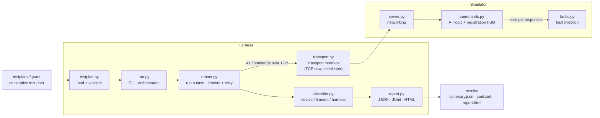

# Modem Conformance Harness

[](https://github.com/rabulsara02/modem-conformance-harness/actions/workflows/ci.yml)

A cellular-modem **conformance test harness**. It has two halves:

- a **simulator** that emulates a modem over TCP — it parses AT commands and models
  network registration as a finite state machine, and can inject real faults on
  demand (delays, garbled replies, dropped connections, wrong answers);
- a **harness** that runs declarative YAML test plans against a modem, and — when a
  case fails — classifies *why*: a **device fault**, a **timeout**, or a **harness
  fault** (a problem on our side).

Every run emits machine-readable (JSON), CI-readable (JUnit XML), and human-readable
(HTML) reports. The whole thing is containerized and runs end-to-end in CI on every
push.

---

## What this proves

When a conformance test fails, the first question in the lab is always: *is it the
device under test, or is it our test setup?* Blaming the device for what was really a
loose cable or a bad test script wastes time and erodes trust in the rig. The
headline capability here is telling those apart — and measuring how well it does it:

> **100% classification accuracy** across labeled fault scenarios (device fault vs
> timeout vs harness fault vs healthy).

It's a compact, honest model of cellular conformance testing: AT-command behavior,
network registration, deliberate fault injection, failure triage, and automated
reporting — built from the **public 3GPP TS 27.007** command set.

---

## Architecture



> Packaged with **Docker**; **Docker Compose** runs the simulator + harness together;
> **GitHub Actions** runs the whole pass on every push.

Two deliberate separations form the backbone:

1. **Plumbing vs brain (simulator).** `server.py` does networking only; `commands.py`
   does command logic only — so the logic is unit-testable with no sockets.
2. **Plan vs engine (harness).** Test cases are YAML *data*; the driver is *code* —
   so adding a test never touches the engine, and non-programmers can contribute
   cases.

The harness talks to the modem through a **`Transport` interface**, not a raw socket,
so a real serial modem can drop in later with zero changes to the driver.

---

## Quick start

### Full conformance pass (Docker — nothing to install)

```bash
docker compose up --build
```

This starts the simulator and runs every test plan against it. Reports land in
`./results/` — open `results/report.html`.

### Local development

```bash
python -m venv .venv && source .venv/bin/activate
pip install -r requirements.txt

pytest                          # unit + integration tests (81)

python -m simulator.server &    # start the modem simulator on :5050
python -m harness.run           # run all plans -> results/{summary.json,junit.xml,report.html}
python -m harness.selfcheck     # measure fault-classification accuracy
```

---

## How it works

**The simulator** exposes a real modem's line-based AT interface over TCP. Each
connection has its own state (echo, SIM readiness, radio functionality, registration,
PDP contexts). Registration is a finite state machine — *SIM not ready → not
registered → registered / roaming* — **derived** from its inputs, so the state can
never drift out of sync. Illegal operations are rejected the way real hardware does
(e.g. attaching to packet service before registering returns `ERROR`).

**The harness** loads a YAML plan, and for each case sends any setup commands, sends
the command under test, and checks the response against an expected substring or
regex — with a per-case timeout and optional retries with exponential backoff. It
records latency and attempt counts, classifies any failure, and renders the run three
ways.

---

## Supported AT commands

All from public 3GPP TS 27.007. Unknown commands and malformed input return an error
(wording depends on `AT+CMEE`) and never crash the server.

| Command | Form(s) | What it does |
|---|---|---|
| `AT` | execute | Attention / liveness check → OK |
| `ATE0` / `ATE1` | basic | Turn command echo off / on |
| `AT+CGMI` | execute | Manufacturer identification |
| `AT+CGMM` | execute | Model identification |
| `AT+CIMI` | execute | IMSI (subscriber id); requires ready SIM |
| `AT+CSQ` | execute | Signal quality (`+CSQ: rssi,ber`) |
| `AT+CPIN` | read / write | SIM status; write a PIN to unlock |
| `AT+CFUN` | read / write / test | Phone functionality (radio on/off) |
| `AT+CREG` | read / write / test | Network registration status |
| `AT+CGATT` | read / write | Packet-service attach/detach |
| `AT+COPS` | read / write / test | Operator selection / name |
| `AT+CGDCONT` | read / write / test | Define/list PDP (data) contexts |
| `AT+CMEE` | read / write / test | Error-report verbosity (0/1/2) |

---

## Fault injection

The simulator can misbehave on demand via a **simulator-only** hook,
`AT+FAULT=<mode>` (not a real AT command — a clearly-separated test hook). Each mode
mirrors a real modem failure:

| Mode | Simulator behavior | Real-world analog |
|---|---|---|
| `delay` | answers correctly but far too late | slow / overloaded firmware |
| `malformed` | returns garbled, non-conforming bytes | corrupted serial data |
| `dropout` | sends nothing and drops the connection | modem crash / unplugged |
| `wrongstate` | answers `OK` to everything, even errors | firmware that lies about success |

---

## Fault classification

When a case fails, the harness labels the cause. Telling a device fault from a
harness fault is the core value of the project.

| Category | Meaning | Detected by |
|---|---|---|
| `PASS` | the case matched its expectation | response matched |
| `DEVICE_FAULT` | modem reachable, but wrong / garbled / dropped | a response arrived, but didn't match |
| `TIMEOUT` | no response within the time window | the read hit its deadline |
| `HARNESS_FAULT` | the failure was on our side | a non-timeout error (couldn't connect, our bug) |

`python -m harness.selfcheck` runs known injected faults (ground truth) and reports
classification accuracy — currently **100% (6/6)**.

---

## Reports & metrics

One summary is rendered three ways (single source of truth):

- **`results/summary.json`** — machine-readable metrics + per-case detail.
- **`results/junit.xml`** — the standard format CI tools read (pass/fail, categories).
- **`results/report.html`** — a self-contained page: totals, category breakdown, and
  a per-case table with fault badges.

Metrics captured every run: case counts, pass rate, per-case latency and total
duration, retry counts, and timeouts.

---

## Project layout

```
modem-conformance-harness/
├── simulator/                 # the fake modem
│   ├── server.py              #   TCP networking
│   ├── commands.py            #   AT command logic + registration state machine
│   └── faults.py              #   on-demand fault injection
├── harness/                   # the test harness
│   ├── testplan.py            #   load + validate YAML plans
│   ├── transport.py           #   Transport interface (TCP now, serial later)
│   ├── runner.py              #   run a case: timeout + retry
│   ├── classifier.py          #   label failures: device / timeout / harness
│   ├── report.py              #   render JSON + JUnit + HTML
│   ├── run.py                 #   CLI: run all plans
│   └── selfcheck.py           #   measure classification accuracy
├── testplans/                 # declarative test cases (YAML)
│   ├── identity.yaml
│   ├── registration.yaml
│   ├── pdp.yaml
│   └── errors.yaml
├── test_*.py                  # 8 test modules (unit + integration), 81 tests
├── conftest.py                # shared pytest fixtures
├── docs/                      # project plan, per-day build log, interview review
├── Dockerfile                 # container image
├── docker-compose.yml         # runs simulator + harness together
└── .github/workflows/ci.yml   # CI: tests + conformance run + report artifact
```

---

## Testing

81 automated tests, split into **unit** tests (command logic, loader, runner, and
classifier — no sockets, fast and deterministic) and **integration** tests (a real
simulator started in-process, driven over a real socket through the transport). Every
YAML case is also run as its own parametrized test. All green in CI on Python 3.13.

---

## Scope & limitations

Deliberately a focused model, not a full 3GPP stack: ~14 AT commands, a
deterministic registration model (real modems have timing, retries, and cell
selection this doesn't model), and invented identity values (manufacturer, IMSI).
The `SEARCHING`/`DENIED`/`ROAMING` states exist and are exercised via fault
injection. Everything is built from **public** 3GPP TS 27.007 — no confidential or
device-specific behavior.
